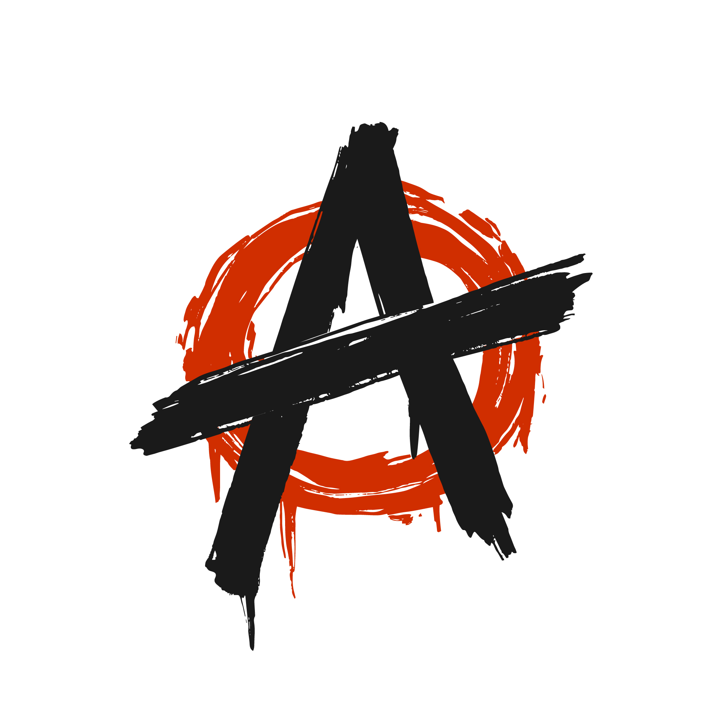

<!-- Improved compatibility of back to top link: See: https://github.com/othneildrew/Best-README-Template/pull/73 -->
<a id="readme-top"></a>
<!--
*** Thanks for checking out the Best-README-Template. If you have a suggestion
*** that would make this better, please fork the repo and create a pull request
*** or simply open an issue with the tag "enhancement".
*** Don't forget to give the project a star!
*** Thanks again! Now go create something AMAZING! :D
-->


<!-- PROJECT SHIELDS -->
<!--
*** I'm using markdown "reference style" links for readability.
*** Reference links are enclosed in brackets [ ] instead of parentheses ( ).
*** See the bottom of this document for the declaration of the reference variables
*** for contributors-url, forks-url, etc. This is an optional, concise syntax you may use.
*** https://www.markdownguide.org/basic-syntax/#reference-style-links
-->
[![Forks][forks-shield]][forks-url]
[![Stargazers][stars-shield]][stars-url]
[![Issues][issues-shield]][issues-url]
[![MIT License][license-shield]][license-url]
[![LinkedIn][linkedin-shield]][linkedin-url]


<!-- PROJECT LOGO -->
<br />
<div align="center">
  <a href="https://github.com/aayushmishramechatronics/portfolio-v0">
    
  </a>

<h3 align="center">Portfolio-v0</h3>

  <p align="center">
    VSCode - Themed Portfolio Website designed and developed by Aayush Mishra.
    <br />
    <a href="https://github.com/aayushmishramechatronics/portfolio-v0"><strong>Explore the Repository »</strong></a>
    <br />
    <br />
    <a href="https://portfolio-v0-alpha.vercel.app/">View Demo</a>
    &middot;
    <a href="https://github.com/aayushmishramechatronics/portfolio-v0/issues/new?labels=bug&template=bug-report---.md">Report Bug</a>
    &middot;
    <a href="https://github.com/aayushmishramechatronics/portfolio-v0/issues/new?labels=enhancement&template=feature-request---.md">Request Feature</a>
  </p>
</div>


<!-- TABLE OF CONTENTS -->
<details>
  <summary>Table of Contents</summary>
  <ol>
    <li>
      <a href="#about-the-project">About The Project</a>
      <ul>
        <li><a href="#built-with">Built With</a></li>
      </ul>
    </li>
    <li>
      <a href="#getting-started">Getting Started</a>
      <ul>
        <li><a href="#prerequisites">Prerequisites</a></li>
        <li><a href="#installation">Installation</a></li>
      </ul>
    </li>
    <li><a href="#usage">Usage</a></li>
    <li><a href="#roadmap">Roadmap</a></li>
    <li><a href="#contributing">Contributing</a></li>
    <li><a href="#license">License</a></li>
    <li><a href="#contact">Contact</a></li>
    <li><a href="#acknowledgments">Acknowledgments</a></li>
  </ol>
</details>


<!-- ABOUT THE PROJECT -->
## About The Project

[![Product Name Screen Shot][product-screenshot]](https://example.com)

This project is a Visual Studio Code-themed developer portfolio website built using TypeScript, Next.js, Tailwind CSS, and JavaScript. Designed to resemble the VSCode interface, it provides an interactive and familiar experience for developers to showcase their skills, projects, and contact information in a sleek, responsive layout.


<p align="right">(<a href="#readme-top">back to top</a>)</p>


### Built With

* [![Next.js][Next.js]][Next-url]
* [![TypeScript][TypeScript]][TypeScript-url]
* [![JavaScript][JavaScript]][JavaScript-url]
* [![Tailwind CSS][Tailwind]][Tailwind-url]

<p align="right">(<a href="#readme-top">back to top</a>)</p>


<!-- GETTING STARTED -->
## Getting Started

Follow these steps to set up and run the project locally on your machine.

### Prerequisites

Ensure you have **Node.js** and **npm** installed on your system.

* npm
  ```sh
  npm install npm@latest -g
  ```

### Installation

1. Clone the repo
   ```sh
   git clone https://github.com/aayushmishramechatronics/portfolio-v0.git
   ```
2. Install NPM packages
   ```sh
   npm install
   ```
3. Change git remote url to avoid accidental pushes to base project
   ```sh
   git remote set-url origin aayushmishramechatronics/portfolio-v0
   git remote -v # confirm the changes
   ```
4. Open your browser and go to http://localhost:3000
   
<p align="right">(<a href="#readme-top">back to top</a>)</p>


<!-- USAGE EXAMPLES -->
## Usage

This VSCode-themed portfolio can be used to:

1. Showcase your skills, experience, and projects

2. Share your resume and contact information

3. Create an engaging developer profile with a familiar code editor look

4. Customize the content and styles easily using the config files and Tailwind utility classes.

<p align="right">(<a href="#readme-top">back to top</a>)</p>


<!-- ROADMAP -->
## Roadmap

- [ ] Add Blog Section
- [ ] Deploy with GitHub Pages / Vercel 
- [ ] Support for Dark/Light Mode Toggle
- [ ] Integrate Animation on Scroll
    - [ ] Code editor tab switching animation

see the [open issues](https://github.com/aayushmishramechatronics/portfolio-v0/issues) for a full list of proposed features (and known issues).

<p align="right">(<a href="#readme-top">back to top</a>)</p>


<!-- CONTRIBUTING -->
## Contributing

Contributions are what make the open source community such an amazing place to learn, inspire, and create. Any contributions you make are **greatly appreciated**.

If you have a suggestion that would make this better, please fork the repo and create a pull request. You can also simply open an issue with the tag "enhancement".
Don't forget to give the project a star! Thanks again!

1. Fork the Project
2. Create your Feature Branch (`git checkout -b feature/FeatureBranch`)
3. Commit your Changes (`git commit -m 'Add Changes'`)
4. Push to the Branch (`git push origin feature/PushtoBranch`)
5. Open a Pull Request

<p align="right">(<a href="#readme-top">back to top</a>)</p>


<!-- LICENSE -->
## License

Distributed under the MIT License. See `LICENSE.txt` for more information.

<p align="right">(<a href="#readme-top">back to top</a>)</p>


<!-- CONTACT -->
## Contact

Aayush Mishra - [@X](https://x.com/AayushMish33852) - aayushmishra1105@gmail.com

Project Link: [https://github.com/github_username/repo_name](https://github.com/aayushmishramechatronics/portfolio-v0)

<p align="right">(<a href="#readme-top">back to top</a>)</p>


<!-- ACKNOWLEDGMENTS -->
## Acknowledgments

* [Nitin Ranganath - VSCode Portfolio](https://vscode-portfolio.vercel.app/github)
* [Image Shields](https://shields.io/)
* [GitHub Pages](https://pages.github.com)
* [Font Awesome](https://fontawesome.com)
* [React Icons](https://react-icons.github.io/react-icons/search)

<p align="right">(<a href="#readme-top">back to top</a>)</p>


<!-- MARKDOWN LINKS & IMAGES -->
<!-- https://www.markdownguide.org/basic-syntax/#reference-style-links -->
[forks-shield]: https://img.shields.io/github/forks/aayushmishramechatronics/portfolio-v0.svg?style=for-the-badge
[forks-url]: https://github.com/aayushmishramechatronics/portfolio-v0/network/members
[stars-shield]: https://img.shields.io/github/stars/aayushmishramechatronics/portfolio-v0.svg?style=for-the-badge
[stars-url]: https://github.com/aayushmishramechatronics/portfolio-v0/stargazers
[issues-shield]: https://img.shields.io/github/issues/aayushmishramechatronics/portfolio-v0.svg?style=for-the-badge
[issues-url]: https://github.com/aayushmishramechatronics/portfolio-v0/issues
[license-shield]: https://img.shields.io/github/license/aayushmishramechatronics/portfolio-v0.svg?style=for-the-badge
[license-url]: https://github.com/aayushmishramechatronics/portfolio-v0/blob/master/LICENSE.txt
[linkedin-shield]: https://img.shields.io/badge/-LinkedIn-black.svg?style=for-the-badge&logo=linkedin&colorB=555
[linkedin-url]: https://www.linkedin.com/in/aayush-anil-mishra/
[product-screenshot]: images/screenshot.png
[Next.js]: https://img.shields.io/badge/Next.js-000000?style=for-the-badge&logo=next.js&logoColor=white
[Next-url]: https://nextjs.org/
[TypeScript]: https://img.shields.io/badge/TypeScript-3178C6?style=for-the-badge&logo=typescript&logoColor=white
[TypeScript-url]: https://www.typescriptlang.org/
[JavaScript]: https://img.shields.io/badge/JavaScript-F7DF1E?style=for-the-badge&logo=javascript&logoColor=black
[JavaScript-url]: https://developer.mozilla.org/en-US/docs/Web/JavaScript
[Tailwind]: https://img.shields.io/badge/Tailwind_CSS-38B2AC?style=for-the-badge&logo=tailwind-css&logoColor=white
[Tailwind-url]: https://tailwindcss.com/
